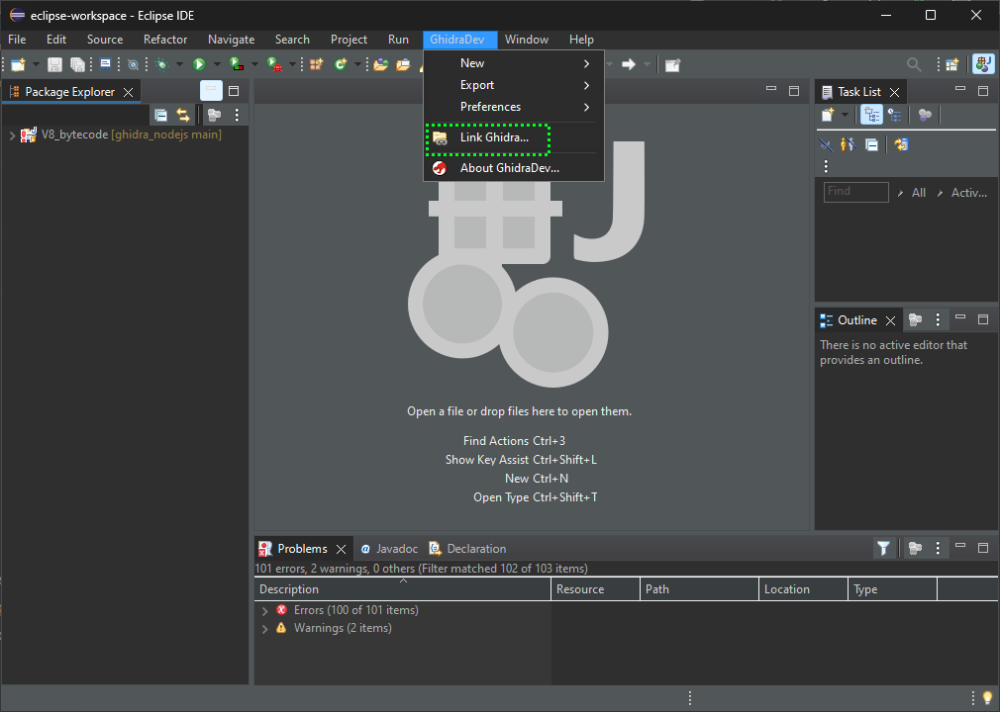
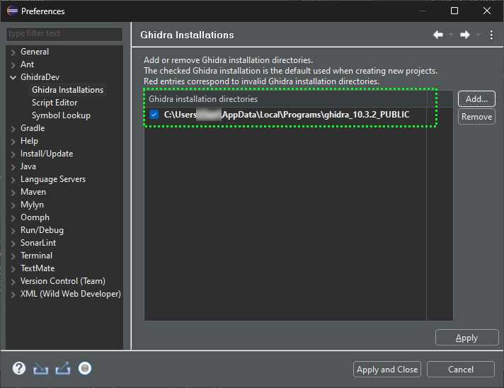
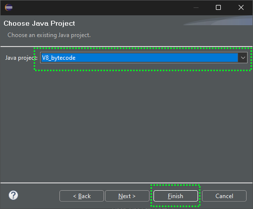
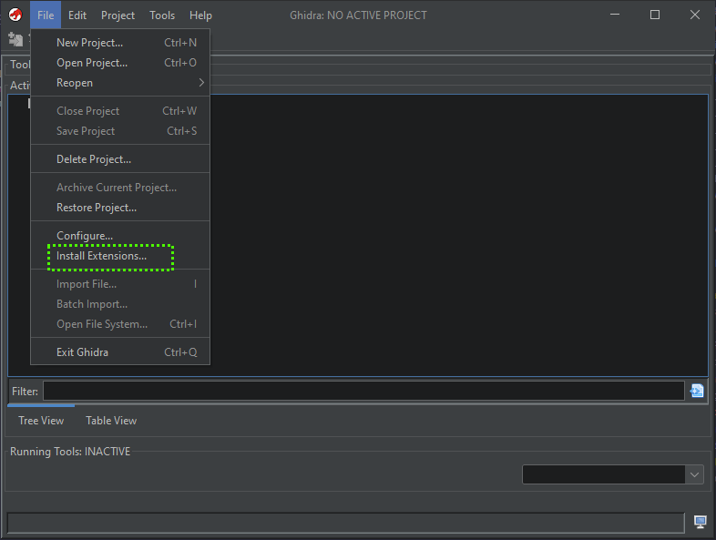
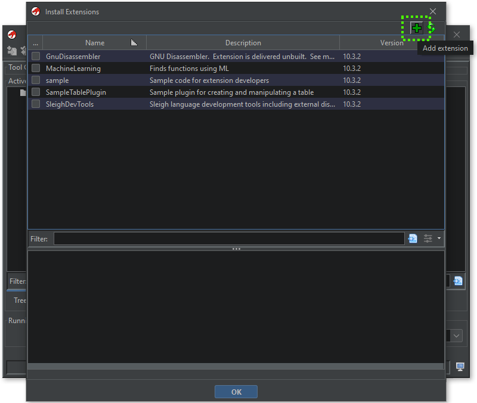
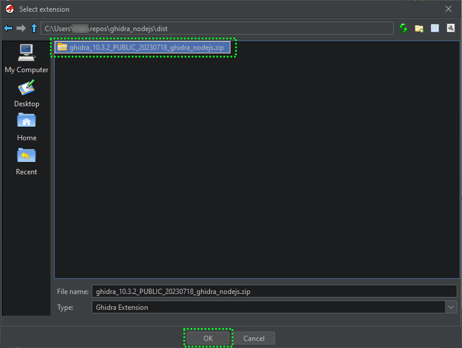
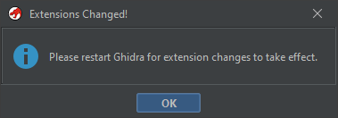

# ghidra_nodejs

## Description

Ghidra plugin to parse, disassemble and decompile NodeJS Bytenode (JSC) binaries.

## Supported NodeJS versions

- v8.16.0 (x64/x86) (V8 version: 6.2.414.77)

## Build instructions

Start by following the [developer's guide at ghidra](https://github.com/NationalSecurityAgency/ghidra/blob/master/DevGuide.md).

### Installing GhidraDev

GhidraDev can be installed either manually into Eclipse or automatically
by Ghidra, depending on your uses cases. The following two sections
outline both procedures.

#### Manual Installation in Eclipse

GhidraDev can be installed into an existing installation of Eclipse the
same way most Eclipse plugins are installed. From Eclipse:

1. Click **Help → Install New Software...**
2. Click **Add...**
3. Click **Archive...**
4. Select GhidraDev zip file
    from *\<GhidraInstallDir\>*/Extensions/Eclipse/GhidraDev/
5. Click **OK** (name field can be blank)
6. Check **Ghidra** category
    (or **GhidraDev** entry)
7. Click **Next**
8. Click **Next**
9. Accept the terms of the license agreement
10. Click **Finish**
11. Check **Unsigned** table entry
12. Click **Trust Selected**
13. Click **Restart Now**

#### Automatic Installation through Ghidra

Ghidra has the ability to launch an externally linked Eclipse when
certain actions are performed, such as choosing to edit a Ghidra script
by clicking the Eclipse icon in the Ghidra Script Manager. Ghidra
requires knowledge of where Eclipse is installed before it can launch
it, and will prompt the user to enter this information if it has not
been defined. Before Ghidra attempts to launch Eclipse, it will attempt
to install GhidraDev into Eclipse's *dropins* directory if
GhidraDev is not already installed.

### Building the plugin

1. Clone the repo
2. Import the repo into Eclipse with **GhidraDev** plugin installed
3. Set the Ghidra path to your local Ghidra installation (using the option in the project's context menu or the GhidraDev extension menu)
4. Export, build the plugin using the project's context menu or the GhidraDev extension. Eclipse will generate a `.zip` archive with the plugin in the `dist` folder.
5. In Ghidra: **File** → **Install Extensions&hellip;**  
    
    Press green plus/`+` button,
     then select the above generated `.zip` archive to install it. 
    Press OK, then Restart Ghidra.
    
6. Drag-n-drop `jsc` files.
